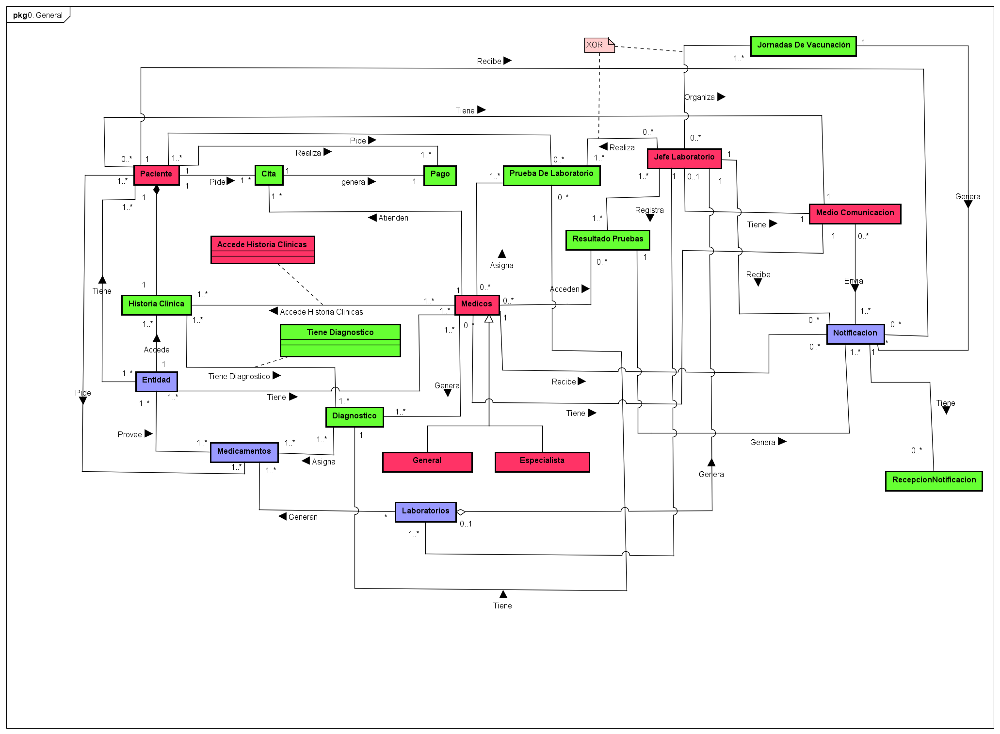

# MBDA - Modelos y de Bases de Datos

Collection of laboratories and projects of the subject "Modelos y de Bases de Datos" at the Escuela Colombiana de Ingeniería Julio Garavito (ECI).

## Purpose

This repository documents the learning process of the MBDA university course, focusing on relational database design, SQL development, data modeling, and iterative database delivery. It includes laboratory assignments and a major iterative project that demonstrates proficiency in SQL, ER/logical modeling with Astah, trigger and view design, CRUD operations, and database security.

Feel free to explore and use any of the resources here for non-commercial and educational purposes. If you find something useful, you're welcome to reference it in your own learning journey.

---

## Labs

The labs are dedicated to progressive learning of relational database concepts, going from basic logical modeling to full SQL implementations with security and constraints.

### Lab 01: Logical Modeling & Keys

Introduction to relational database fundamentals. Covers:

- Entity-Relationship and logical data modeling
- Primary keys, foreign keys, and unique keys (`claves lab01`)
- Astah-based logical diagram (`lab01 asta.asta`)
- Visual logical model export (`logico.png`)

---

### Lab 02: Relational Model Refinement

Continuation of Lab 01 with an evolution of the relational schema and model organization. Covers:

- Refinement of the logical model
- Class and relationship adjustments

---

### Lab 03: SQL Fundamentals

First structured SQL implementation lab. Covers:

- Table creation with DDL
- Basic query writing and DML operations
- Schema consistency with the logical model

---

### Lab 04: Trueques — Exchange Domain Design

A domain-focused laboratory centered on modeling and implementing a barter/exchange system. Covers:

- Object-oriented analysis of the "Trueques" domain
- Astah-based logical model (`TruequesLab04.asta`)
- SQL DDL and DML implementation (`Laboratorio04.sql`)
- Logical schema documentation (`LOGICOO.txt`)

---

### Lab 05: Advanced SQL — Triggers, Views & CRUD

A comprehensive SQL lab covering advanced database features. Covers:

- Trigger design and implementation
- View creation and index usage
- Full CRUD operation scripting
- Implementation of Packages and Security
- Astah documentation (`LAB05.asta`)
- Formal lab report (`LAB 05.docx`)

---

### Lab 06: Final Integration Lab

Final laboratory integrating all course concepts into a complete database solution. Covers:

- Full schema design and SQL implementation
- Integration of constraints, triggers, views, and security
- Complete deliverable packaging
- Implementation of XML

---

## Projects

### CareBaseSystems — Hospital Data Management System (2 Cycles)

The main course project: a fully functional hospital database system designed to solve day-to-day problems in data flow and management, unifing de system with appointment scheduling and access to patient medical records. Developed across two delivery cycles with incremental refinement.

**Stakeholders:** Ministry of Health (real-time resource coordination and demand monitoring), health authorities, and hospital administrative staff.

#### Cycle 1 — Initial Design and Full Implementation

- Project definition document (`00 DefProyecto.pdf`)
- Logical model diagrams (`00 MODELO-LOGICO-A.png`, `00 MODELO-LOGICO-B.png`)
- Full SQL scripts covering:
  - **DDL:** Tables, attributes, primary keys, foreign keys, unique keys
  - **DML:** Data population (valid and invalid cases)
  - **Queries:** Consultas, tuples, actions
  - **Triggers:** Valid and invalid trigger scenarios
  - **Views:** View creation and validation
  - **CRUD:** Complete create, read, update, delete operations
  - **Security:** Role-based actors and access control
  - **Cleanup scripts:** Drop tables, triggers, views, CRUD, security

#### Cycle 2 — Refined Design and Extended SQL

- Updated logical model (`MODELO LOGICO.png`)
- Full Astah design file (`00 CareBaseSystemsF.asta`)
- Draw.io project diagram (`Ciclo 2 Proyecto.drawio`)
- Refined with extensions of SQL scripts for all DDL, DML, triggers, views, indices, CRUD, and security
- Extended test cases and data scenarios

---

## Class Diagram

---

## Technologies Used

- SQL (Oracle SQL Developer)
- Astah Professional (ER and logical modeling)
- Draw.io (diagram design)
- Git

---

## Authors

- [@Tulio3101](https://github.com/tulio3101)
- [@JulianLopez11](https://github.com/JulianLopez11)

---

## License

Distributed under the MIT License. See `LICENSE` for more information.
